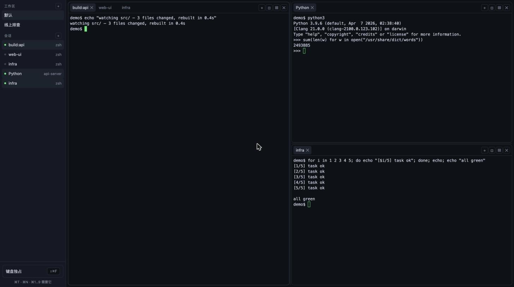
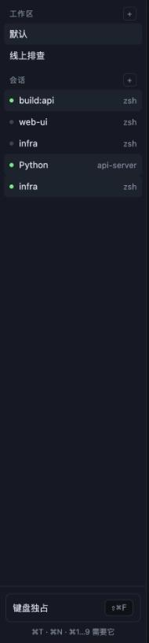
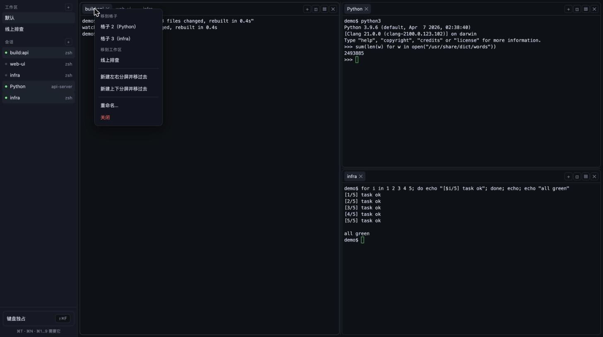
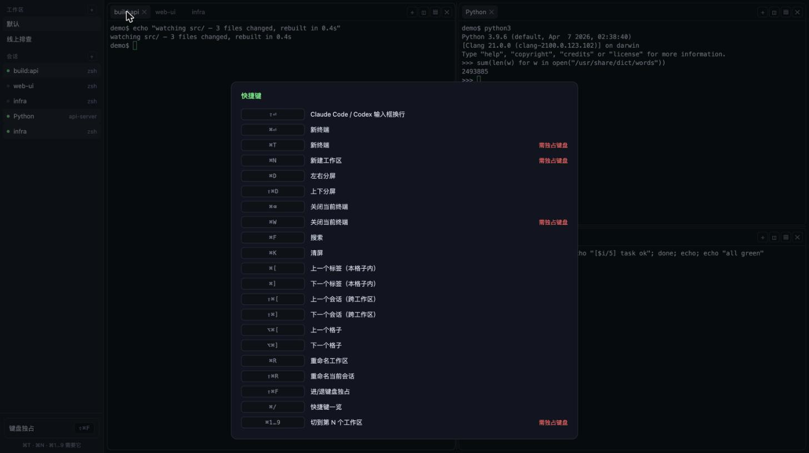

# webmux

**把服务器上的一堆终端，变成浏览器里一个能收拾干净的工作台。**



## 它解决什么问题

你在服务器上同时开着好几摊事：一个在跑构建、一个在盯日志、一个是刚查到一半的
线上问题、还有两三个开了忘了关的 shell。

于是每天都在重复这几件事：

- **合不上电脑。** 关掉终端，跑着的东西就断了。想换个地方接着干，得先想想哪些能关。
- **找不到人。** 十几个 tmux 窗口只有编号，`0`、`1`、`2`——哪个是哪个全靠记。
- **不知道谁动了。** 后台那个任务跑完没有？不切过去看一眼永远不知道。
- **摊不开。** 一块屏幕上想同时看构建和日志，得靠记快捷键去劈窗口，劈完还不好调。

webmux 把这些收进一个网页：**会话在侧栏列着、名字自己会取、有新输出会亮、
屏幕想怎么分就怎么分**。而真正跑着的进程一直待在服务器上——关掉网页、断网、
甚至重启 webmux 自己，它们都还在。

## 用起来是什么感觉

### 每个会话都有名字，而且名字自己会变

不用手动命名。webmux 看终端里正在发生什么，自动起名：

- 程序自己报了名字（比如构建工具、AI 编程助手），就用它
- 正在跑某个命令，就显示命令名
- 什么都没跑，就显示当前在哪个目录——「在哪」总比「是个 bash」有用



侧栏左边那个小圆点就是状态：

- **绿色**——正看着它
- **黄色**——有新输出，你还没看
- **红色**——里面的进程已经退了

右边小字补另一半信息：名字是命令名时显示目录，反过来显示命令。

不满意就右键改名，改完就固定下来；名字清空，又回到自动跟随。

<br clear="right">

### 屏幕怎么分都行，终端随手挪

左右劈、上下劈、嵌套着劈都可以，分割线直接拖。想把某个终端挪到别的格子或别的
工作区，右键菜单里直接列出所有去处——不用记快捷键，也不用跟拖拽较劲。



### 一屏放不下就用工作区

「日常开发」「线上排查」各开一个工作区，互不打扰，一键切换。

### 键盘能用得跟本地终端一样

常用操作都有快捷键，`⌘/` 随时查表。



浏览器保留的那几个键（新建标签页、关窗口、切标签）本来会被浏览器抢走，
开一下**键盘独占**就能还给终端。

`Shift+Enter` 也调好了——在 Claude Code、Codex 这类工具的输入框里是换行，不是提交。

### 截图直接甩给终端里的 AI

`⌘V` 粘图，或者把图片拖进来。图片会存到这个会话当前所在的目录，路径自动打进
命令行——终端里跑着的 AI 助手直接就能读。

### 嵌到别的系统里

单终端页面没有侧栏和标签，一个 `iframe` 就能嵌进你自己的运维平台、工单系统或
内部工具里，按名字引用同一个会话，页面刷新进程也不重启。


## 谁会用得上

- **需要长时间跑东西的人**——训练、构建、批处理、爬数据，关了电脑它还在跑
- **在服务器上用 AI 编程助手的人**——多个助手各占一个会话，一屏摊开，截图随手就能给它看
- **要在好几台机器之间来回切的人**——网页开着就行，不用一台台 ssh 进去找 tmux 窗口
- **想把终端嵌进自己平台的团队**——一个 iframe 的事

## 关它会发生什么

| 情况 | 结果 |
| --- | --- |
| 关掉浏览器、断网、换台电脑打开 | 什么都没变，接着用 |
| webmux 自己重启或升级 | 终端全都活着，连往上翻的历史都在 |
| 布局配置文件丢了 | 布局重来，**会话一个都不丢**——它们会列在侧栏「不在任何工作区」里，点一下就收回来 |
| 服务器重启 | 终端进程跟着没。要跨重启的任务本来就该交给 systemd |

## 开始使用

服务器上装好 tmux 和 Node，然后：

```bash
git clone git@github.com:iterationjia/webmux.git
cd webmux
npm install && npm run build:web
npm start
```

浏览器打开 `http://127.0.0.1:7788` 就行了。

要从别的机器访问、要开 HTTPS、要跑多份实例，看 [安装与配置](docs/install.md)。

## 说明

- **单人自用的工具**，没有账号体系，一个访问令牌就是全部门槛。
- 它给的是**一个完整的服务器 shell**。别把它开到公网上不设令牌——那等于把机器交出去。
- 想知道为什么这么设计，看 [DESIGN.md](DESIGN.md)。
